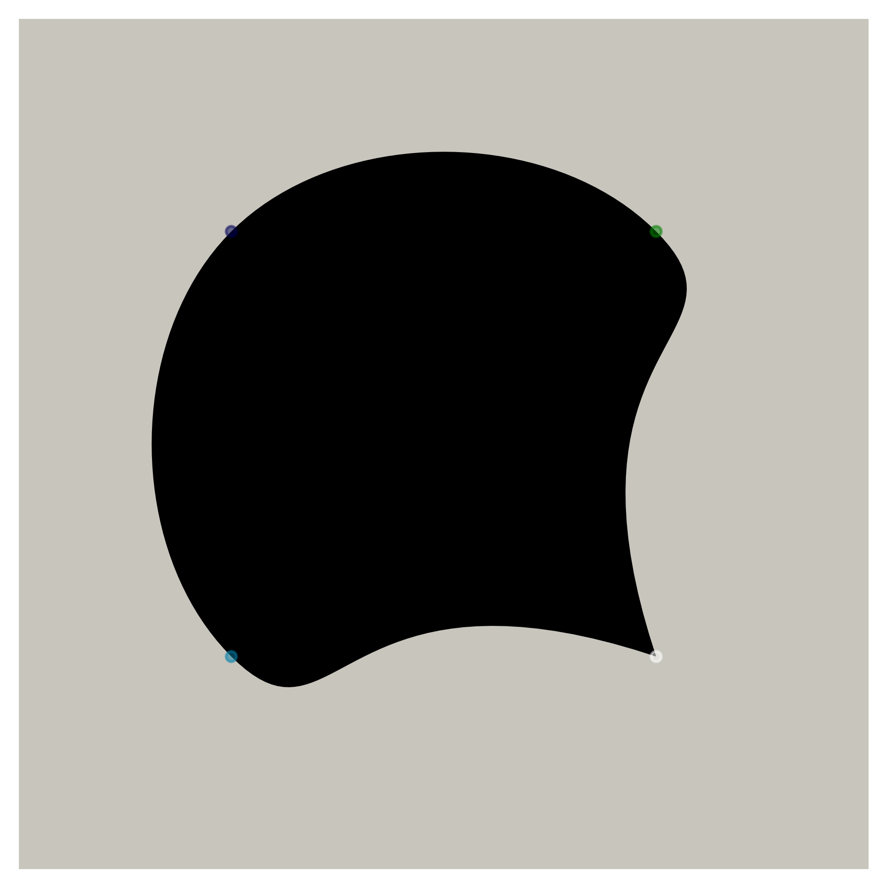
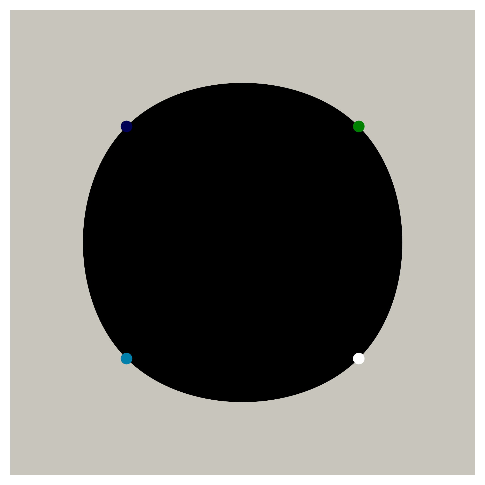
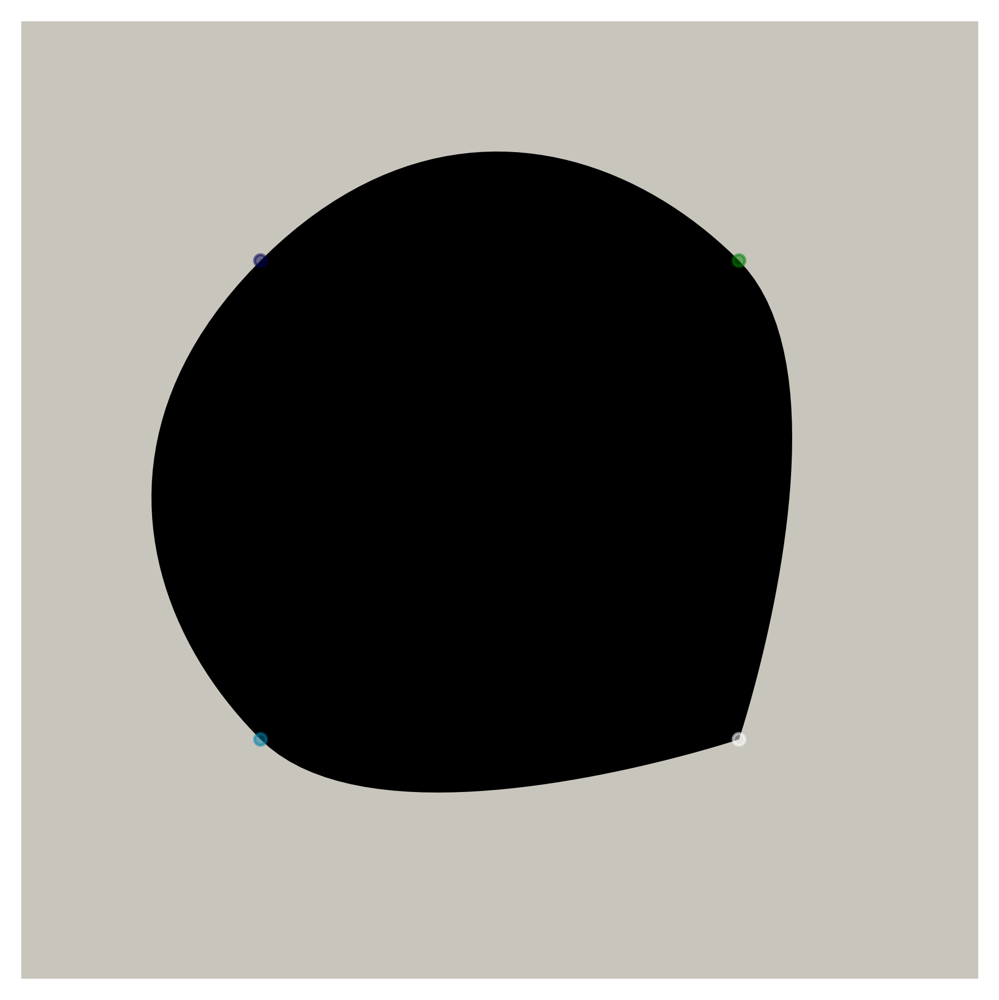
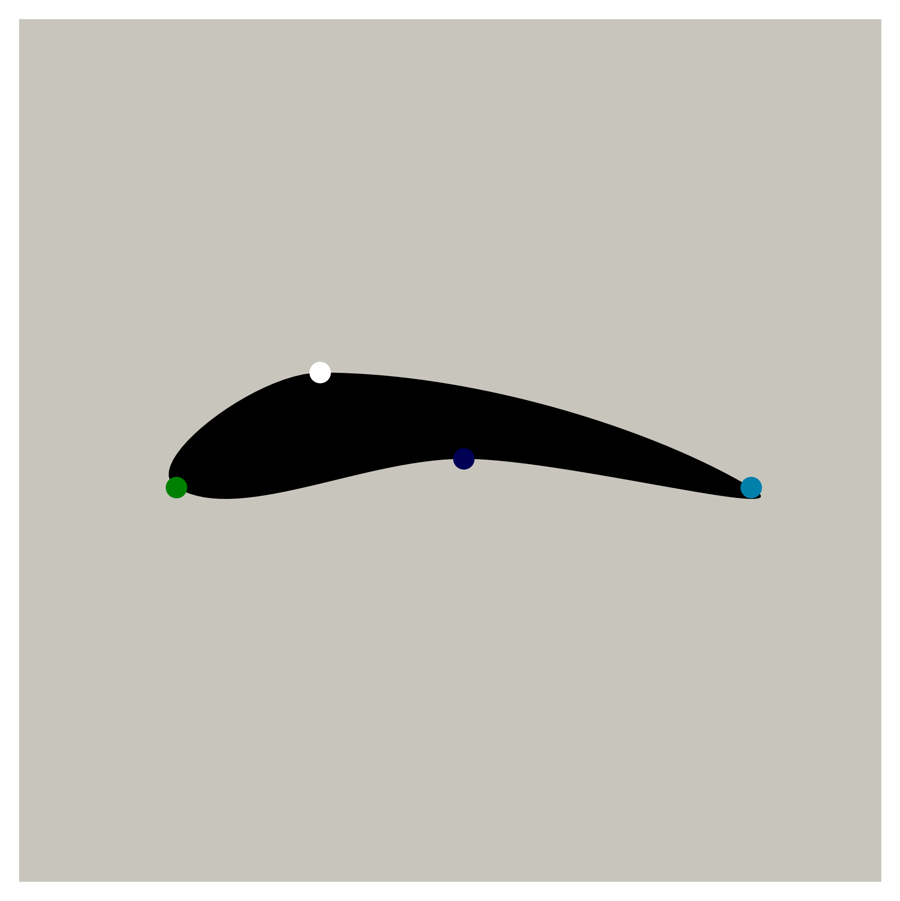
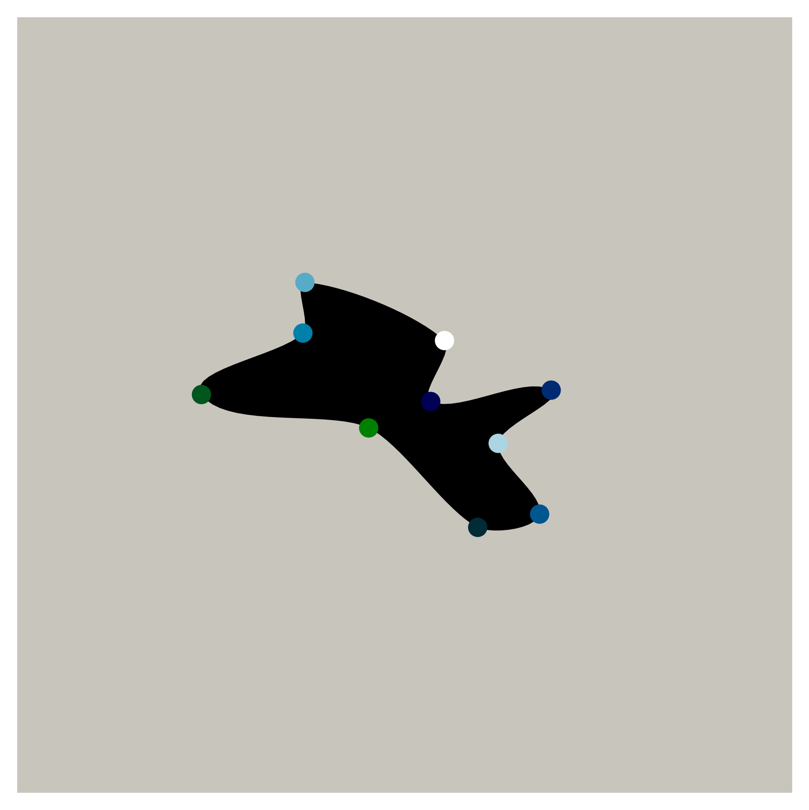

# bshapes

<p align="center">
  
</p>

This repository contains tools to generate random shapes using Bezier curves (images and meshes), controlling the number of points and the local curvature and sharpness. It is also possible to generate shapes by joining specified points using an in-house csv format, and to generate full sets of random shapes with variable parameters.

## Citation

The work contained in this repository was developed for use in the following papers: 
- *"A supervised neural network for drag prediction of arbitrary 2D shapes in low Reynolds number flows"* <a href="https://arxiv.org/abs/1907.05090">here</a> and <a href="https://www.sciencedirect.com/science/article/abs/pii/S0045793020302164">here</a>
- *"U-net architectures for fast prediction of incompressible laminar flows"* <a href="https://arxiv.org/abs/1910.13532">here</a>
- *"Direct shape optimization through deep reinforcement learning"* <a href="https://arxiv.org/abs/1908.09885">here</a> and <a href="https://www.sciencedirect.com/science/article/pii/S0021999120308548">here</a>

If you make use of this repo for your research, please consider citing them. This work was elaborated on the basis of <a href="https://stackoverflow.com/a/50751932/3237302">this StackOverflow answer</a>, although there are now significant differences in behavior and features.

## Issues

This work is provided with no guarantee whatsoever.
If you find something wrong, please raise an issue. However, there is no guarantee I will have time to look into it.
PRs are welcome, but the same warning applies.

## CSV format

```
n_pts n_splg_pts
x1 y1 r1 e1
x2 y2 r2 e2
...
xn yn rn en
```

- ```n_ctrl_pts``` is the actual number of points you control on the shape. Each such point is joined with the next one using a cubic Bezier curve
- ```n_splg_pts``` is the number of sampling points per unit of distance between two control points
- ```xi yi``` are the coordinates of the control points
- ```ri``` is the local radius around control point ```i```. It measures how far the local control points are from the point you provided
- ```ei``` is a local measure of sharpness

Give a look at the examples below for a better understanding of the effects of radius and sharpness parameters. Maximum smoothness is usually obtained for ```r = 0.5``` and ```e = 0.0``` on all points.

## Shape examples

<table>
<tr>
<td> ```csv``` </td> <td> ```shape``` </td>
</tr>
<tr>
<td>

```
4 30
1.0 1.0 0.707 0.0
-1.0 1.0 0.707 0.0
-1.0 -1.0 0.707 0.0
1.0 -1.0 0.707 0.0
```
</td>
<td> <p align="center">  </p>
</td>
</tr>
<tr>
<td>

```
4 30
1.0 1.0 0.707 0.0
-1.0 1.0 1.0 0.0
-1.0 -1.0 0.707 0.0
1.0 -1.0 0.0 0.0
```
</td>
<td> <p align="center">  </p>
</td>
</tr>
<tr>
<td>

```
4 30
1.0 1.0 0.707 0.0
-1.0 1.0 0.707 0.0
-1.0 -1.0 0.707 0.0
1.0 -1.0 0.707 1.0
```
</td>
<td> <p align="center">  </p>
</td>
</tr>
<tr>
<td>

```
4 30
-1.0 0.0 0.5 0.0
0.0 0.1 0.7 0.0
1.0 0.0 0.5 0.0
-0.5 0.4 0.7 0.0
```
</td>
<td> <p align="center">  </p>
</td>
</tr>
<tr>
<td>

```
10 30
-0.22344386973718572 -0.11579347020968898 0.5 0.0
-1.086703349116176 0.056471511909076864 0.5 0.0
0.33918645130375696 -0.6285322803621614 0.5 0.0
0.09673486000147186 0.020665843303720587 0.5 0.0
0.7184144807034846 0.07933772977561572 0.5 0.0
0.658776975915066 -0.5602669680651731 0.5 0.0
-0.5629917814532847 0.37355108023884465 0.5 0.0
-0.5526944074292542 0.6349363861837116 0.5 0.0
0.44487187686581814 -0.19528679943835178 0.5 0.0
0.16784876294630274 0.3349169666644063 0.5 0.0
```
</td>
<td> <p align="center">  </p>
</td>
</tr>
</table>

## Generating datasets

Generate a dataset of random shapes using ```python3 dataset.py``` (parameters of the dataset can be modified inside the python file). It will generate images and meshes in separated folders.
